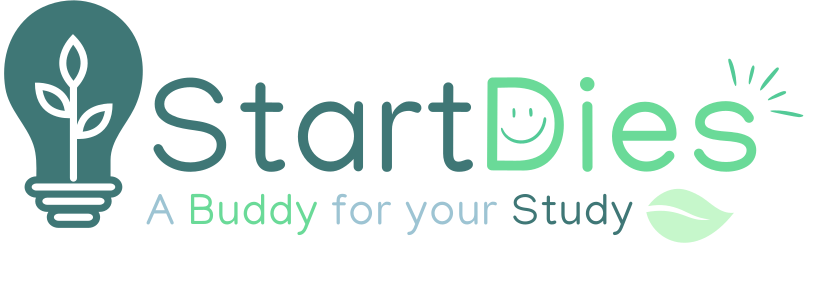

# StartDies



---

## 🚀 Overview

StartDies is a modern educational study application designed to help learners of all ages master new concepts through interactive flashcards, quizzes, and personalized progress tracking. With a clean, intuitive interface and powerful study tools, StartDies makes learning efficient and engaging.

## ✨ Features

- **Custom Flashcards**: Create, edit, and organize flashcards into decks.
- **Quiz Modes**: Multiple-choice, true/false, and written-answer quizzes.
- **Enhanced Learning**: Enhance your education with our fun methods of study.

## 🛠 Installation

1. **Clone the repository**

   ```bash
   git clone https://github.com/yourusername/StartDies.git
   cd StartDies
   ```

2. **Install dependencies**

   ```bash
   npm install
   npm install bootstrap express
   ```

3. **Start the development servers**

   ```bash
   # Terminal 1: Start the Express server
   node server.js
   ```

   ```bash
   # Terminal 2: Start the React development server
   npm start
   ```

4. **Access the application**

   Frontend: [http://localhost:3000](http://localhost:3000)  
   Backend: [http://localhost:5050](http://localhost:5050)

5. **Build for production**

   ```bash
   npm run build
   ```

## 📜 License

This project is licensed under the MIT License. See the [LICENSE](LICENSE) file for details.

Happy studying! 🎓
